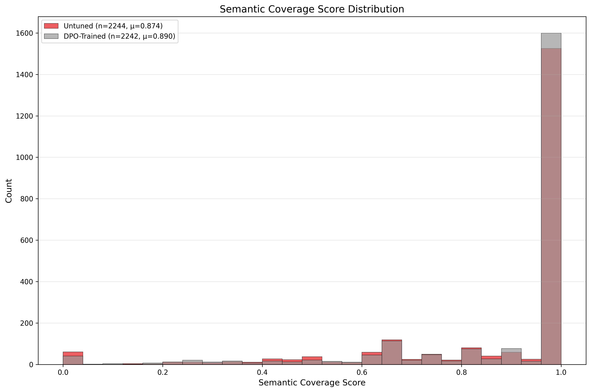
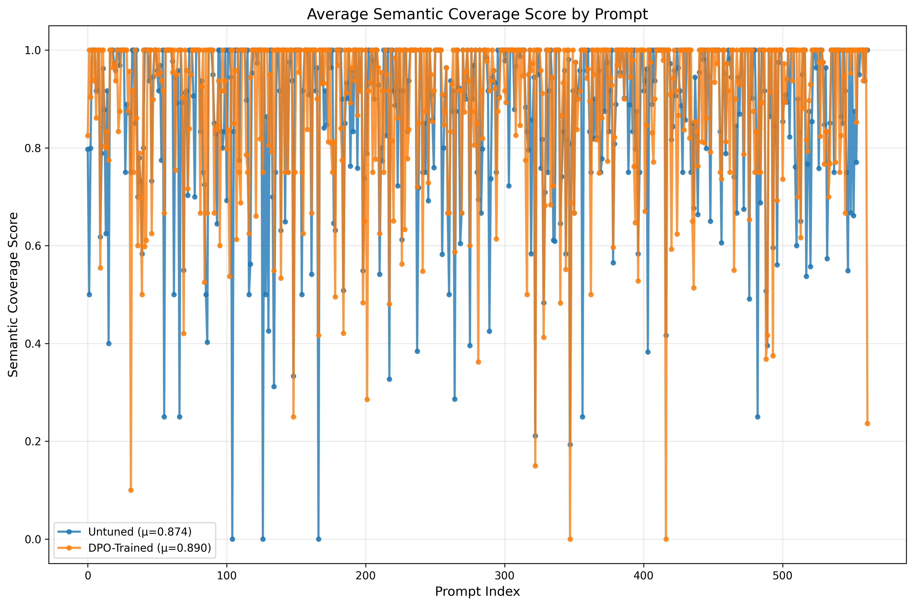

## Diffusion DPO：基于偏好的对齐与评测

### 主要功能

项目概览与效果：

- 目标：自动化评测文生图模型在“语义覆盖”和“关系理解”等可解释指标上的表现，并利用偏好优化（DPO）进行对齐训练，提升模型的指令遵循与语义保真能力。
- 流程：数据准备 → 模板抽取 → 多模态评测 → 指标计算 → 偏好样本构造 → DPO 训练 → 生成与复评 → 可视化分析。
- 指标：`semantic_coverage`（核心）、`relation_validity`、`style_score` 等。
- 结论（示例实验）：以 `semantic_coverage` 为主构造的偏好数据用于 DPO 训练后，语义覆盖显著提升，分布右移且方差变小，体现更稳定的指令遵循；关系与风格维度亦呈现正向趋势。

- 分布（重叠直方图）：

  

- 分布（按模型子图）：

  

补充代表性图表：

- 关系有效性（分布）：

  

- 风格分数（分布）：

  

总体对比：



观察（语义覆盖）：

- DPO 训练后分布整体右移且更集中（均值更高、方差更小），表明语义保真度与指令遵循更好、更稳定。

引用（DPO 训练代码来源声明）：

- 本项目的 DPO 训练代码参考并改编自 Salesforce AI Research 的开源实现 DiffusionDPO [GitHub 仓库链接](https://github.com/SalesforceAIResearch/DiffusionDPO/tree/main)。
- 引用：Wallace, B., Dang, M., Rafailov, R., Zhou, L., Lou, A., Purushwalkam, S., Ermon, S., Xiong, C., Joty, S., & Naik, N. (2023). Diffusion Model Alignment Using Direct Preference Optimization. Retrieved from https://github.com/SalesforceAIResearch/DiffusionDPO/tree/main

---

### 端到端流程

1. 生成提示与图像（现有管线）

- 使用 `eva_diff/sd.py` 或 `eva_diff/script/gen_img.sh` 基于提示生成图像。

2. 构建评测模板

```bash
bash eva_diff/script/extract_templates.sh
```

- 输入：`prompts.txt`
- 输出：`templates.json`，用于向多模态大模型发起结构化评测

3. 运行多模态评测，获取原始响应

```bash
bash eva_diff/script/run_eval.sh
```

- 关键参数：`--model_type`, `--model_path`, `--images_dir`, `--template_file`, `--save_dir`, `--file_name`
- 输出：`{...}_eval_results.json`（每张图的结构化 JSON）

4. 将原始响应转换为标量指标（分数）

```bash
bash eva_diff/script/calculate_metrics.sh
```

- 输出：`{...}_scores.json`，包含 `semantic_coverage`、`relation_validity`、`style_score`、`object_num` 字段

5. 构建 DPO 偏好数据（成对样本）

- 支持单指标或复合指标

```bash
# 单指标
python3 eva_diff/build_preference_dataset.py \
  --scores_file <scores.json> \
  --prompts_file eva_diff/prompts.txt \
  --images_dir <images_dir> \
  --output_file <output.pkl> \
  --primary_metric semantic_coverage

# 复合指标示例：
#   semantic_coverage+relation_validity
#   semantic_coverage+style_score
#   relation_validity+style_score
#   semantic_coverage+relation_validity+style_score
python3 eva_diff/build_preference_dataset.py ... --primary_metric semantic_coverage+relation_validity
```

- Output: `.pkl` preference pairs and `_metadata.json`

6. 转换为 HuggingFace 数据集（可选）

```bash
python3 eva_diff/preference_dataset_loader.py \
  --dataset_path <output.pkl> \
  --convert_to_hf <hf_dataset_dir>
```

7. 使用 DPO 进行训练

```bash
bash train_with_preference_data.sh
```

- 脚本中的关键参数：
  - `--pretrained_model_name_or_path` 基座 SD 模型
  - `--dataset_name` 本地 HF 数据集目录
  - `--beta_dpo` KL 强度（见“原理”）
  - `--max_train_steps`, `--gradient_accumulation_steps`, `--train_batch_size`
  - `--report_to tensorboard|wandb`

8. 使用 DPO 模型生成

```bash
bash eva_diff/script/generate_with_dpo_model.sh
```

- 从 DPO 输出目录加载完整 pipeline；包含 `variant=fp16` 的兼容回退

9. 分析分数并可视化

```bash
# Line plots (all metrics)
bash eva_diff/tools/line_plot_analysis.sh

# Histograms (all metrics; overlapped + subplots)
bash eva_diff/tools/histogram_analysis.sh
```

- 输出默认保存在 `eva_diff/analysis_results/`（可在脚本中自定义）

---

### 原理：用于扩散模型的 DPO

给定提示 x 以及两张图像 y₀（偏好）和 y₁（非偏好），成对的 DPO 目标鼓励微调后的模型 p_θ(y|x) 相较于 y₁ 更偏好 y₀，同时通过 β 加权的 KL 约束保持与参考模型 p_ref 的接近。常见的标量化形式如下：

\[ \mathcal{L}(\theta) = \mathbb{E}_{(x, y_0, y_1)} \left[ \log \sigma\left( \beta \big( \log p_\theta(y*0\!\mid x) - \log p*\theta(y*1\!\mid x) \big) - \beta \big( \log p*{\\text{ref}}(y*0\!\mid x) - \log p*{\\text{ref}}(y_1\!\mid x) \big) \right) \right] \]

- β（beta_dpo）用于缩放 KL 引导的偏好间隔。β 过大可能导致过度正则化。
- 在扩散模型中，似然差异通过噪声预测（UNet）在 DDPM 轨迹上的“能量替代”进行近似。

`train.py` 中的训练细节：

- 冻结 VAE 与文本编码器，仅训练 UNet
- 将成对图片在通道维拼接；用标签控制左右顺序
- 损失使用 `beta_dpo` 缩放“模型-参考”的差异

---

### 脚本速查（一键命令）

- 模板

```bash
bash eva_diff/script/extract_templates.sh
```

- 评测

```bash
bash eva_diff/script/run_eval.sh
```

- 从评测 JSON 计算指标

```bash
bash eva_diff/script/calculate_metrics.sh
```

- 构建偏好数据（单/复合指标）

```bash
python3 eva_diff/build_preference_dataset.py --scores_file <scores.json> --prompts_file eva_diff/prompts.txt --images_dir <imgs> --output_file <pairs.pkl> --primary_metric <metric_or_combo>
```

- 转换为 HF 数据集

```bash
python3 eva_diff/preference_dataset_loader.py --dataset_path <pairs.pkl> --convert_to_hf <hf_dir>
```

- 训练 DPO

```bash
bash train_with_preference_data.sh
```

- 用 DPO 模型生成图像

```bash
bash eva_diff/script/generate_with_dpo_model.sh
```

- 绘图（折线）

```bash
bash eva_diff/tools/line_plot_analysis.sh
```

- 绘图（直方图）

```bash
bash eva_diff/tools/histogram_analysis.sh
```

通用参数：

- `--score_files`：多个分数 JSON 文件
- `--labels`：图例对应标签
- `--metric`：`semantic_coverage`、`relation_validity`、`style_score` 之一
- `--plot_type`：`line`、`hist` 或 `hist_subplots`
- `--bins`：直方图分箱数量（脚本默认统一为 25）
- `--output`：输出图片路径；若父目录不存在会自动创建

---

### 提示与故障排查

- 若遇 `wandb` 403：设置 `WANDB_MODE=offline` 或修复组织权限；也可使用 `--report_to tensorboard`
- `accelerate` 相关冲突：确保与 `diffusers`、`transformers`、`huggingface_hub` 的版本兼容
- 本地数据集：当 `--dataset_name` 指向本地目录时，`train.py` 支持 `datasets.load_from_disk()`
- Pipeline 加载：当 `variant=fp16` 权重不可用时，`sd.py` 会自动回退

---

### 结论

本评测 + DPO 管线在语义覆盖与指令遵循方面带来可量化的提升。所提供的脚本可在各阶段通过一行命令实现可复现的评分、偏好数据构造、训练与分析。
