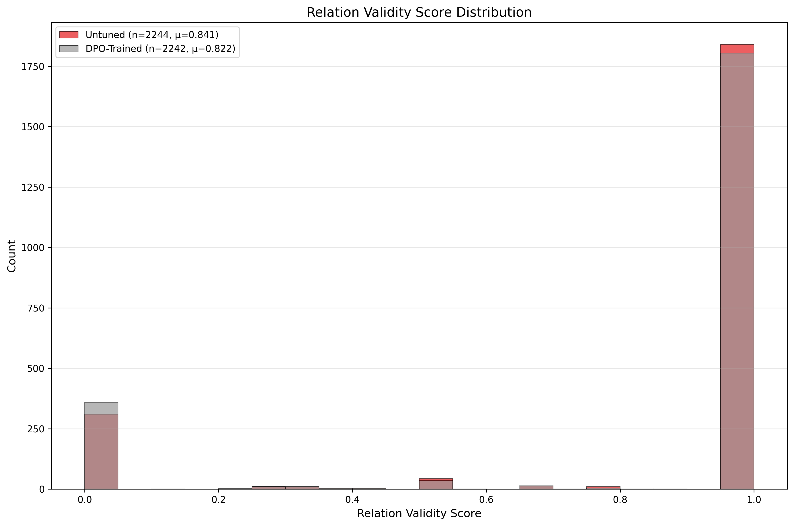

## Diffusion DPO: Preference-based Alignment and Evaluation

### Highlights (Semantic Coverage)

Project overview and results:

- Goal: Automatically evaluate text-to-image diffusion models with interpretable metrics such as semantic coverage and relation understanding, and align the diffusion model via Direct Preference Optimization (DPO) to improve instruction following and semantic fidelity.
- Pipeline: data preparation → template extraction → multimodal evaluation → metric computation → preference pair construction → DPO training → generation and re-evaluation → visualization.
- Metrics: `semantic_coverage` (primary), `relation_validity`, `style_score`.
- Key finding (example study): DPO trained on `semantic_coverage`-driven preferences improves semantic coverage with a right-shifted, tighter distribution, indicating more stable instruction following. Relation and style dimensions also trend positively.

- Line plot (avg score per prompt):

  

- Distribution (overlapped hist):

  

- Distribution (per-model subplots):

  

Representative additional charts:

- Relation validity (distribution):

  

- Style score (distribution):

  

Overall comparison:


Observation (semantic_coverage):

- The DPO-trained model distribution shifts right and tightens (higher mean, lower variance), indicating better semantic fidelity and more consistent instruction following.

Acknowledgment and citation (DPO training code source):

- Our DPO training code references and adapts from Salesforce AI Research’s DiffusionDPO [repository link](https://github.com/SalesforceAIResearch/DiffusionDPO/tree/main).
- Formal citation: Wallace, B., Dang, M., Rafailov, R., Zhou, L., Lou, A., Purushwalkam, S., Ermon, S., Xiong, C., Joty, S., & Naik, N. (2023). Diffusion Model Alignment Using Direct Preference Optimization. Retrieved from https://github.com/SalesforceAIResearch/DiffusionDPO/tree/main

---

### End-to-End Workflow

1. Generate prompts and images (existing pipeline)

- Use `eva_diff/sd.py` or `eva_diff/script/gen_img.sh` to produce images from prompts.

2. Build evaluation templates

```bash
bash eva_diff/script/extract_templates.sh
```

- Input: prompts.txt
- Output: templates.json used to query VLM for structured judgments

3. Run multimodal evaluation to get raw responses

```bash
bash eva_diff/script/run_eval.sh
```

- Key args: `--model_type`, `--model_path`, `--images_dir`, `--template_file`, `--save_dir`, `--file_name`
- Output: `{...}_eval_results.json` (structured VLM JSON per-image)

4. Convert raw responses to scalar metrics (scores)

```bash
bash eva_diff/script/calculate_metrics.sh
```

- Output: `{...}_scores.json` with fields: `semantic_coverage`, `relation_validity`, `style_score`, `object_num`

5. Build preference dataset (pairs) for DPO

- Single or composite metric selection supported

```bash
# Single metric
python3 eva_diff/build_preference_dataset.py \
  --scores_file <scores.json> \
  --prompts_file eva_diff/prompts.txt \
  --images_dir <images_dir> \
  --output_file <output.pkl> \
  --primary_metric semantic_coverage

# Composite metric examples
#   semantic_coverage+relation_validity
#   semantic_coverage+style_score
#   relation_validity+style_score
#   semantic_coverage+relation_validity+style_score
python3 eva_diff/build_preference_dataset.py ... --primary_metric semantic_coverage+relation_validity
```

- Output: `.pkl` preference pairs and `_metadata.json`

6. Convert to HuggingFace datasets (optional)

```bash
python3 eva_diff/preference_dataset_loader.py \
  --dataset_path <output.pkl> \
  --convert_to_hf <hf_dataset_dir>
```

7. Train with DPO

```bash
bash train_with_preference_data.sh
```

- Key args (in script):
  - `--pretrained_model_name_or_path` base SD model
  - `--dataset_name` local HF dataset dir
  - `--beta_dpo` KL strength (see principle)
  - `--max_train_steps`, `--gradient_accumulation_steps`, `--train_batch_size`
  - `--report_to tensorboard|wandb`

8. Generate with the DPO model

```bash
bash eva_diff/script/generate_with_dpo_model.sh
```

- Loads full pipeline from DPO output dir; includes fallback for `variant=fp16`

9. Analyze scores and visualize

```bash
# Line plots (all metrics)
bash eva_diff/tools/line_plot_analysis.sh

# Histograms (all metrics; overlapped + subplots)
bash eva_diff/tools/histogram_analysis.sh
```

- Outputs are saved under `eva_diff/analysis_results/` by default (you can customize output paths in the scripts).

---

### Principle: DPO for Diffusion

Given a prompt x and two images y₀ (preferred) and y₁ (dispreferred), the pair-level DPO objective encourages the fine-tuned model p_θ(y|x) to prefer y₀ over y₁ while remaining close to a reference p_ref via a β-weighted KL. A common scalarized form of the objective maximizes:

\[ \mathcal{L}(\theta) = \mathbb{E}_{(x, y_0, y_1)} \left[ \log \sigma\left( \beta \big( \log p_\theta(y*0\!\mid x) - \log p*\theta(y*1\!\mid x) \big) - \beta \big( \log p*{\\text{ref}}(y*0\!\mid x) - \log p*{\\text{ref}}(y_1\!\mid x) \big) \right) \right] \]

- β (beta_dpo) scales the KL-guided preference margin. Larger β emphasizes alignment vs. the reference separation signal; too large may over-regularize.
- In diffusion, log-likelihood differences are approximated via noise-prediction (UNet) energy surrogates over the trajectory under a DDPM scheduler.

Training specifics in `train.py`:

- VAE and text encoder are frozen; UNet is trained
- Pairs are concatenated along channel dimension; labels control ordering
- Loss uses `beta_dpo` to scale preference-vs-reference differences

---

### Script Reference (One-liners)

- Templates

```bash
bash eva_diff/script/extract_templates.sh
```

- Evaluation

```bash
bash eva_diff/script/run_eval.sh
```

- Metrics from eval JSON

```bash
bash eva_diff/script/calculate_metrics.sh
```

- Build preferences (single/composite)

```bash
python3 eva_diff/build_preference_dataset.py --scores_file <scores.json> --prompts_file eva_diff/prompts.txt --images_dir <imgs> --output_file <pairs.pkl> --primary_metric <metric_or_combo>
```

- Convert to HF dataset

```bash
python3 eva_diff/preference_dataset_loader.py --dataset_path <pairs.pkl> --convert_to_hf <hf_dir>
```

- Train DPO

```bash
bash train_with_preference_data.sh
```

- Generate images from DPO model

```bash
bash eva_diff/script/generate_with_dpo_model.sh
```

- Plot (line)

```bash
bash eva_diff/tools/line_plot_analysis.sh
```

- Plot (hist)

```bash
bash eva_diff/tools/histogram_analysis.sh
```

Parameters (common):

- `--score_files`: list of JSON score files
- `--labels`: matching labels for legend
- `--metric`: one of `semantic_coverage`, `relation_validity`, `style_score`
- `--plot_type`: `line`, `hist`, or `hist_subplots`
- `--bins`: histogram bins (default unified to 25 in scripts)
- `--output`: output image path; parent dir auto-created

---

### Tips & Troubleshooting

- If `wandb` 403: set `WANDB_MODE=offline` or fix org permissions; `--report_to tensorboard` works offline
- `accelerate` conflicts: ensure compatible versions with `diffusers`, `transformers`, `huggingface_hub`
- Local datasets: `train.py` supports `datasets.load_from_disk()` when `--dataset_name` is a local dir
- Pipeline loading: `sd.py` falls back if `variant=fp16` weights are unavailable

---

### Conclusion

The evaluation + DPO pipeline measurably improves semantic coverage and adherence to instructions. The provided scripts allow fully reproducible scoring, preference construction, training, and analysis with one-line commands per stage.
